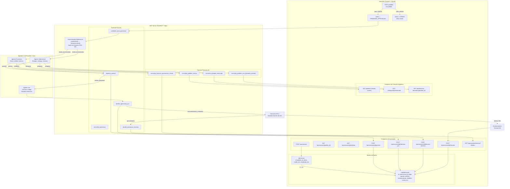
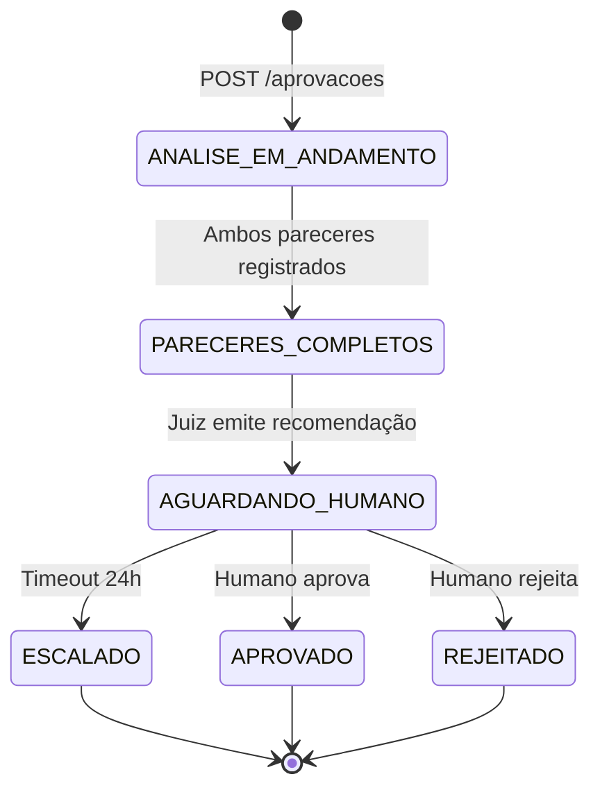
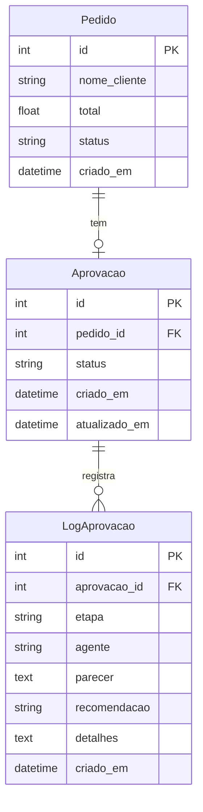

# Design: Aprovação Automatizada de Pedidos de Alto Valor

## Diagrama de Arquitetura

## Diagrama de Estados da Aprovação

## Modelo de Dados

## Novas MCP Tools

### Tools de Fluxo de Aprovação

**Tool:** `submeter_para_aprovacao(pedido_id: int)`
**Propósito:** Inicia o processo de aprovação para um pedido > R$10k. Cria o registro de Aprovacao no ERP e retorna os dados do pedido anonimizados para os agentes analisarem.
**Input:** `{ pedido_id: int }`
**Output:** `{ aprovacao_id: int, pedido_id: int, status: str, pedido: { id, cliente_anonimizado, total, itens[] } }`
**Erros:** Pedido não encontrado (404); Pedido com total ≤ R$10.000 (400)

---

**Tool:** `registrar_parecer(pedido_id: int, agente: str, parecer: str, recomendacao: str)`
**Propósito:** Registra o parecer de um agente (financeiro ou operacional). Quando ambos estão registrados, transiciona o status para PARECERES_COMPLETOS. O parecer é desanonimizado antes de salvar no banco.
**Input:** `{ pedido_id: int, agente: "financeiro" | "operacional", parecer: str, recomendacao: "APROVAR" | "REJEITAR" }`
**Output:** `{ log_id: int, etapa: str, status_aprovacao: str }`
**Erros:** Aprovação não encontrada (404); Parecer duplicado para o mesmo agente (400)

---

**Tool:** `consultar_aprovacao(pedido_id: int)`
**Propósito:** Retorna o status completo de uma aprovação com todos os logs de cada etapa. Dados de cliente são anonimizados na resposta.
**Input:** `{ pedido_id: int }`
**Output:** `{ aprovacao: { id, pedido_id, status, criado_em, atualizado_em }, logs: [{ etapa, agente, parecer, recomendacao, criado_em }] }`
**Erros:** Aprovação não encontrada (404)

---

**Tool:** `decidir_aprovacao_juiz(pedido_id: int, decisao: str, justificativa: str)`
**Propósito:** Registra a decisão do Juiz (LLM-as-a-Judge) após avaliar os pareceres dos dois agentes. Transiciona para AGUARDANDO_HUMANO. A justificativa é desanonimizada antes de salvar.
**Input:** `{ pedido_id: int, decisao: "APROVAR" | "REJEITAR", justificativa: str }`
**Output:** `{ log_id: int, status_aprovacao: "AGUARDANDO_HUMANO" }`
**Erros:** Pareceres ainda incompletos (400); Aprovação não encontrada (404)

---

**Tool:** `decidir_aprovacao_humana(pedido_id: int, decisao: str, responsavel: str, comentario: str)`
**Propósito:** Registra a decisão final do humano (HITL). Transiciona a aprovação e o pedido para APROVADO ou REJEITADO. Não aplica anonimização — o humano trabalha com dados reais.
**Input:** `{ pedido_id: int, decisao: "APROVAR" | "REJEITAR", responsavel: str, comentario: str }`
**Output:** `{ log_id: int, status_aprovacao: "APROVADO" | "REJEITADO", status_pedido: str }`
**Erros:** Aprovação não está em AGUARDANDO_HUMANO (400); Aprovação não encontrada (404)

### Tools de Pesquisa para Agentes

**Tool:** `consultar_pedidos_cliente(nome_cliente: str)`
**Propósito:** Retorna todos os pedidos de um cliente. O agente envia o pseudônimo; a tool desanonimiza para consultar o ERP e reanonimiza a resposta. Usado pelo Agente Financeiro para avaliar histórico de compras.
**Input:** `{ nome_cliente: str }`
**Output:** `{ pedidos: [{ id, cliente_anonimizado, total, status, criado_em, itens[] }] }`
**Erros:** Nenhum pedido encontrado para o cliente (retorna lista vazia)

---

**Tool:** `consultar_historico_aprovacoes_cliente(nome_cliente: str)`
**Propósito:** Retorna o histórico de aprovações anteriores de um cliente. Desanonimiza o nome para consultar e reanonimiza a resposta. Usado pelo Agente Financeiro para avaliar padrão de aprovações.
**Input:** `{ nome_cliente: str }`
**Output:** `{ aprovacoes: [{ id, pedido_id, status, criado_em }] }`
**Erros:** Sem histórico de aprovações (retorna lista vazia)

---

**Tool:** `consultar_estoque_reservado(produto_id: int)`
**Propósito:** Calcula a quantidade de estoque reservada por pedidos ainda não faturados (status CRIADO, PENDENTE_APROVACAO, APROVADO). Usado pelo Agente Operacional para avaliar disponibilidade real.
**Input:** `{ produto_id: int }`
**Output:** `{ produto_id: int, estoque_total: int, estoque_reservado: int, estoque_disponivel: int }`
**Erros:** Produto não encontrado (404)

---

**Tool:** `consultar_pedidos_nao_faturados_produto(produto_id: int)`
**Propósito:** Lista pedidos não faturados que contêm um produto específico. Nomes de clientes são anonimizados. Usado pelo Agente Operacional para detalhar as reservas de estoque.
**Input:** `{ produto_id: int }`
**Output:** `{ pedidos: [{ id, cliente_anonimizado, total, status, quantidade_produto: int }] }`
**Erros:** Produto não encontrado (404)