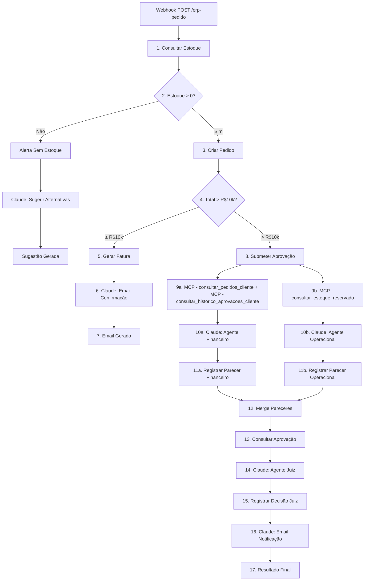
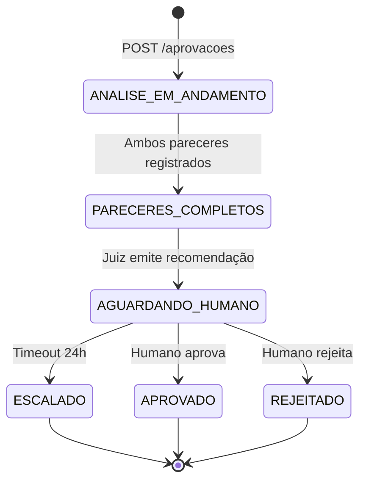
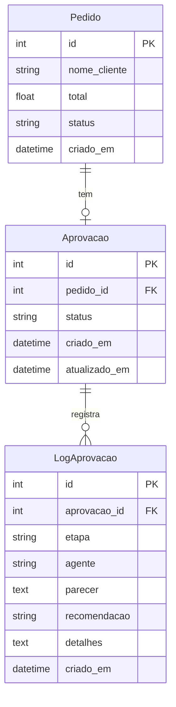

# Design: Aprovação Automatizada de Pedidos de Alto Valor

## Orquestração n8n

O workflow n8n (`artifacts/n8n/workflow_erp.json`) é o orquestrador determinístico de todo o fluxo. Ele coordena chamadas HTTP ao ERP e chamadas à API Anthropic, sem depender do MCP Server (que serve apenas LLMs interativos).

**Por que n8n?** Já é usado no lab, permite paralelismo nativo, oferece UI visual para debug, e mantém o workflow stateless — cada execução é independente.

**Fluxo de aprovação no n8n:**

**HITL fora do workflow:** O humano recebe o e-mail de notificação com pedido_id, valor, recomendação e justificativa, e decide via API REST (`POST /aprovacoes/{id}/decisao-humana`). Se não decidir em 24h, um mecanismo externo (cron/alerta) aciona o endpoint de escalonamento.

**Agentes LLM via API Anthropic direta:** Os nós Claude do n8n chamam `api.anthropic.com/v1/messages` com `claude-haiku-4-5-20251001` (análises) e `claude-sonnet-4-5-20251001` (juiz). Não passam pelo MCP Server — os system prompts dos agentes são inline no workflow. A anonimização é feita no MCP Server chamado antes das ações dos LLM para que contexto seja fornecido de forma segura.

## Diagrama de Estados da Aprovação

## Modelo de Dados

## Novas MCP Tools

### Tools de Pesquisa para Agente Financeiro

**Tool:** `consultar_pedidos_cliente(nome_cliente: str)`
**Propósito:** Retorna todos os pedidos de um cliente. O agente envia o pseudônimo; a tool desanonimiza para consultar o ERP e reanonimiza a resposta. Usado pelo Agente Financeiro para avaliar histórico de compras.
**Input:** `{ nome_cliente: str }`
**Output:** `{ pedidos: [{ id, cliente_anonimizado, total, status, criado_em, itens[] }] }`
**Erros:** Nenhum pedido encontrado para o cliente (retorna lista vazia)

---

**Tool:** `consultar_historico_aprovacoes_cliente(nome_cliente: str)`
**Propósito:** Retorna o histórico de aprovações anteriores de um cliente. Desanonimiza o nome para consultar e reanonimiza a resposta. Usado pelo Agente Financeiro para avaliar padrão de aprovações.
**Input:** `{ nome_cliente: str }`
**Output:** `{ aprovacoes: [{ id, pedido_id, status, criado_em }] }`
**Erros:** Sem histórico de aprovações (retorna lista vazia)

### Tools de Pesquisa para Agente Operacional

**Tool:** `consultar_estoque_reservado(produto_id: int)`
**Propósito:** Calcula a quantidade de estoque reservada por pedidos ainda não faturados (status CRIADO, PENDENTE_APROVACAO, APROVADO). Usado pelo Agente Operacional para avaliar disponibilidade real.
**Input:** `{ produto_id: int }`
**Output:** `{ produto_id: int, estoque_total: int, estoque_reservado: int, estoque_disponivel: int }`
**Erros:** Produto não encontrado (404)

---