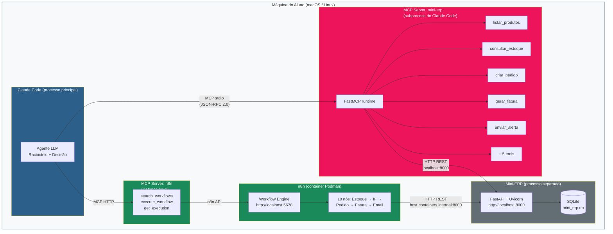
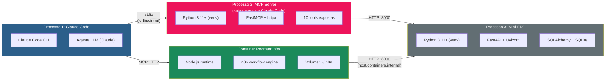
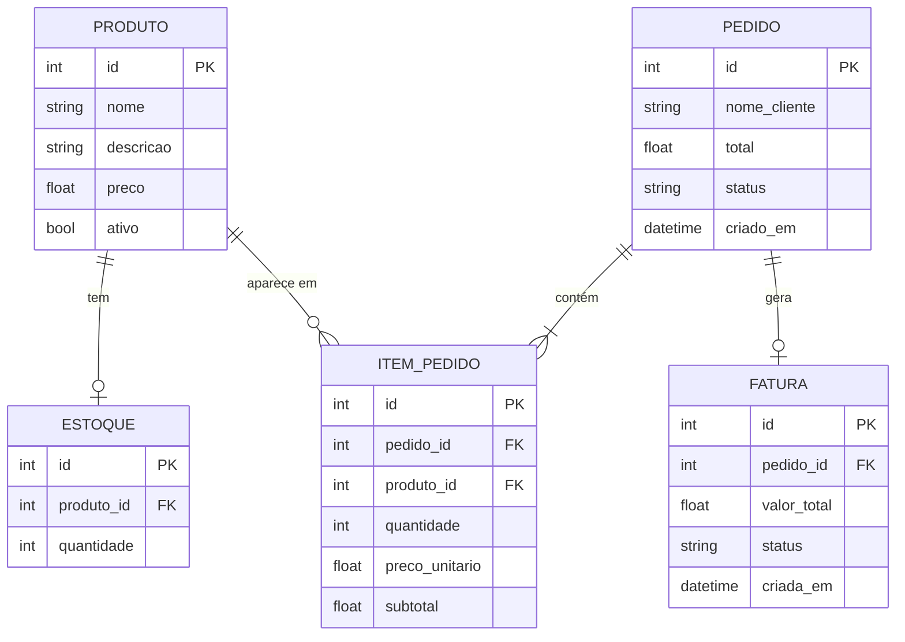
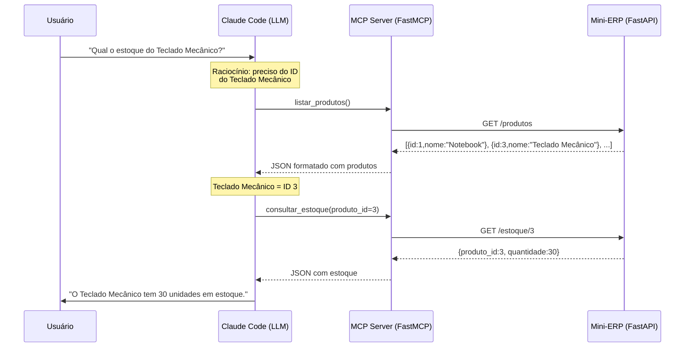
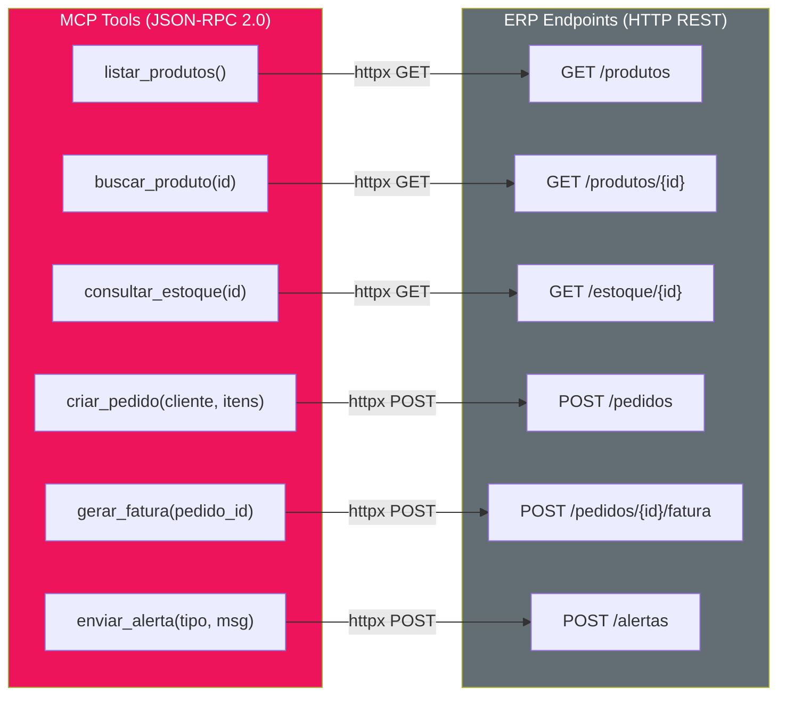
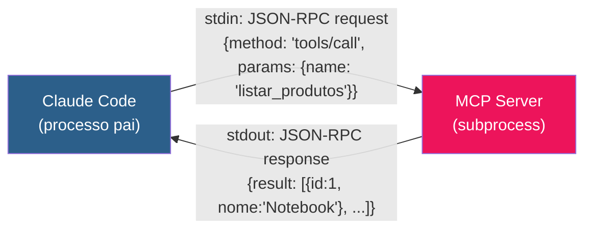
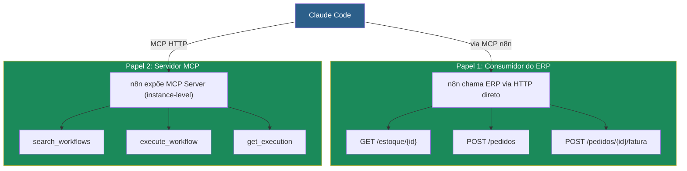
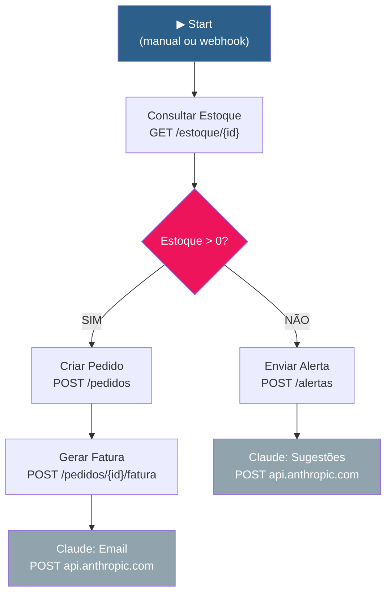
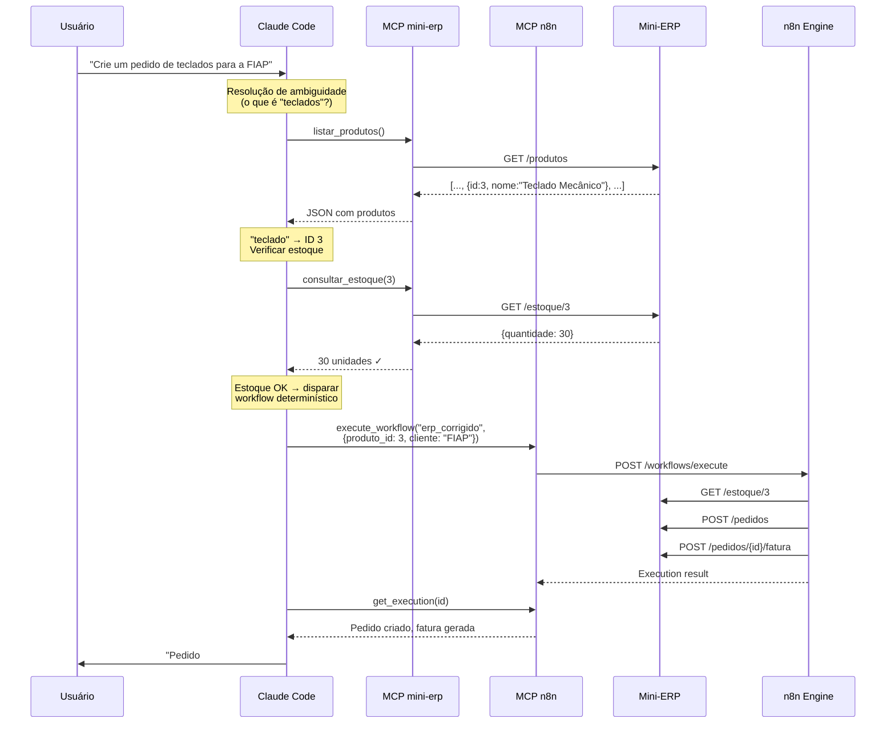
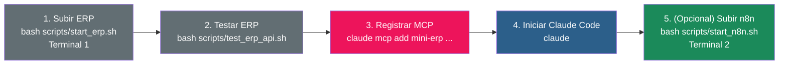

# Arquitetura e Desenvolvimento do MCP Server do Mini-ERP

Material didático — Aula 03: Claude Code Avançado, Servidores MCP e Orquestração

---

## 1. Visão Geral da Arquitetura

O laboratório implementa uma arquitetura de 3 camadas onde um **MCP Server** atua como intermediário entre agentes de IA e um ERP convencional. O agente (Claude Code) nunca acessa o ERP diretamente — toda comunicação passa pelo MCP Server, que traduz chamadas MCP em requisições HTTP REST.

### Diagrama de arquitetura completa



### Onde cada componente roda



**Resumo de processos:**

| Componente | Tipo de processo | Runtime | Porta | Comunicação |
|-----------|-----------------|---------|-------|-------------|
| **Claude Code** | Processo principal (CLI) | Node.js + Claude API | — | Inicia MCP como subprocess |
| **MCP Server mini-erp** | Subprocess do Claude Code | Python 3.11 (venv) | — (stdio) | stdin/stdout com Claude Code |
| **Mini-ERP** | Processo independente | Python 3.11 (venv) | 8000 | HTTP REST |
| **n8n** | Container Podman | Node.js (imagem n8nio/n8n) | 5678 | HTTP REST + MCP HTTP |

---

## 2. Camada 1: Mini-ERP (FastAPI + SQLite)

### O que é

API REST convencional que simula um ERP de distribuição/vendas. Gerencia produtos, estoque, pedidos, faturas e alertas. Construído com FastAPI + SQLAlchemy + SQLite.

### Modelo de dados



### Endpoints REST

| Método | Rota | Descrição | Exemplo |
|--------|------|-----------|---------|
| GET | `/health` | Health check | `{"status": "ok"}` |
| GET | `/produtos` | Lista produtos ativos | 4 produtos (Webcam está inativa) |
| GET | `/produtos/{id}` | Busca produto por ID | Notebook Básico |
| GET | `/estoque/{id}` | Consulta estoque | `{"quantidade": 10}` |
| POST | `/pedidos` | Cria pedido + abate estoque | Valida estoque antes |
| GET | `/pedidos` | Lista pedidos recentes | Últimos 10 |
| GET | `/pedidos/{id}` | Detalhes do pedido + itens | Status: CRIADO ou FATURADO |
| POST | `/pedidos/{id}/fatura` | Gera fatura | Muda status para FATURADO |
| GET | `/faturas/{id}` | Consulta fatura | Valor total + data |
| POST | `/alertas` | Registra alerta (em memória) | Tipos: estoque_insuficiente, etc. |
| GET | `/alertas` | Lista últimos 20 alertas | Mais recentes primeiro |

### Dados iniciais (seed)

| ID | Produto | Preço | Estoque | Ativo |
|----|---------|-------|---------|-------|
| 1 | Notebook Básico | R$ 2.500 | 10 | Sim |
| 2 | Mouse USB | R$ 50 | 100 | Sim |
| 3 | Teclado Mecânico | R$ 350 | 30 | Sim |
| 4 | Monitor 24pol | R$ 1.200 | 15 | Sim |
| 5 | Webcam HD | R$ 200 | 50 | **Não** |

### Localização e execução

```
lab/ERP/
├── app/
│   ├── main.py          # FastAPI app + lifespan (cria tabelas e seed)
│   ├── db.py            # Engine SQLAlchemy + SQLite (data/mini_erp.db)
│   ├── models.py        # 5 modelos: Produto, Estoque, Pedido, ItemPedido, Fatura
│   ├── schemas.py       # Pydantic schemas (request/response)
│   ├── seed.py          # Popula 5 produtos + estoque inicial
│   └── routes/
│       ├── produtos.py  # GET /produtos, GET /produtos/{id}
│       ├── estoque.py   # GET /estoque/{id}
│       ├── pedidos.py   # POST/GET /pedidos, GET /pedidos/{id}
│       ├── faturas.py   # POST /pedidos/{id}/fatura, GET /faturas/{id}
│       └── alertas.py   # POST/GET /alertas (in-memory)
├── data/
│   └── mini_erp.db      # SQLite (criado automaticamente)
├── requirements.txt     # fastapi, uvicorn, sqlalchemy, pydantic
└── venv/                # Ambiente virtual Python
```

**Subir:** `bash scripts/start_erp.sh` ou manualmente:
```bash
cd lab/ERP && source venv/bin/activate && uvicorn app.main:app --reload --port 8000
```

**Swagger UI:** http://localhost:8000/docs

---

## 3. Camada 2: MCP Server (FastMCP + httpx)

### O que é

Servidor MCP que encapsula o Mini-ERP como **10 tools autodescritivas**. Usa a biblioteca FastMCP (Python) e se comunica via transporte **stdio** (standard input/output). Funciona como um **adapter**: traduz chamadas MCP (JSON-RPC 2.0) em requisições HTTP REST ao ERP.

### Diagrama de fluxo de uma chamada



### Anatomia do código

O MCP Server tem 166 linhas de Python e consiste em 3 partes:

**Parte 1 — Configuração e helper HTTP (~30 linhas)**

```python
ERP_BASE_URL = "http://localhost:8000"

mcp = FastMCP(
    "Mini-ERP",
    instructions="Servidor MCP para o Mini-ERP Didático. Use as tools ..."
)

async def _erp_request(method: str, path: str, body: dict | None = None) -> dict:
    """Faz requisição HTTP ao ERP e retorna JSON."""
    async with httpx.AsyncClient(base_url=ERP_BASE_URL, timeout=10) as client:
        resp = await client.get(path) if method == "GET" else await client.post(path, json=body)
        resp.raise_for_status()
        return resp.json()
```

- `FastMCP("Mini-ERP")` — cria o servidor com nome e instruções
- `_erp_request()` — helper genérico que faz GET ou POST no ERP
- Toda tool chama `_erp_request()` internamente

**Parte 2 — 10 tools com decorador `@mcp.tool()` (~120 linhas)**

Cada tool segue o mesmo padrão:

```python
@mcp.tool()
async def listar_produtos() -> str:
    """Lista todos os produtos ativos do ERP.

    Retorna nome, preço, descrição e status de cada produto.
    Use para descobrir quais produtos estão disponíveis antes de criar pedidos.
    """
    data = await _erp_request("GET", "/produtos")
    return json.dumps(data, ensure_ascii=False, indent=2)
```

Pontos-chave para o arquiteto:
- O **decorador** `@mcp.tool()` registra a função como tool MCP
- A **docstring** é o que o LLM lê para decidir quando usar a tool — precisa ser precisa
- Os **type hints** dos parâmetros viram o JSON Schema automaticamente
- O retorno é **string** (JSON formatado) — o LLM interpreta

**Parte 3 — Entrypoint (~3 linhas)**

```python
if __name__ == "__main__":
    mcp.run()  # Inicia o servidor em modo stdio
```

### Mapeamento tool → endpoint



### As 10 tools completas

| # | Tool | Parâmetros | Endpoint HTTP | Tipo |
|---|------|-----------|--------------|------|
| 1 | `listar_produtos` | — | GET /produtos | Consulta |
| 2 | `buscar_produto` | `produto_id: int` | GET /produtos/{id} | Consulta |
| 3 | `consultar_estoque` | `produto_id: int` | GET /estoque/{id} | Consulta |
| 4 | `criar_pedido` | `nome_cliente: str, itens: list[dict]` | POST /pedidos | Ação |
| 5 | `listar_pedidos` | `limit: int = 10` | GET /pedidos | Consulta |
| 6 | `consultar_pedido` | `pedido_id: int` | GET /pedidos/{id} | Consulta |
| 7 | `gerar_fatura_simulada` | `pedido_id: int` | POST /pedidos/{id}/fatura | Ação |
| 8 | `consultar_fatura` | `fatura_id: int` | GET /faturas/{id} | Consulta |
| 9 | `enviar_alerta` | `tipo: str, mensagem: str, detalhes: dict?` | POST /alertas | Ação |
| 10 | `listar_alertas` | — | GET /alertas | Consulta |

### Transporte: stdio



- Claude Code **inicia** o MCP Server como subprocess (`python main.py`)
- Comunicação bidirecional via **stdin/stdout** (pipes do sistema operacional)
- Protocolo: **JSON-RPC 2.0** sobre as pipes
- Sem porta de rede, sem HTTP, sem autenticação — segurança do processo local
- Se o Claude Code encerrar, o subprocess morre automaticamente

### Localização e execução

```
lab-aula03/mcp_server/
├── main.py              # 166 linhas: FastMCP + 10 tools + httpx
├── requirements.txt     # mcp[cli]>=1.0.0, httpx>=0.27.0
└── venv/                # Criado pelo start_mcp.sh
```

**Registrar no Claude Code:**
```bash
claude mcp add mini-erp -- /caminho/para/venv/bin/python /caminho/para/main.py
```

**Testar com MCP Inspector:**
```bash
cd mcp_server && source venv/bin/activate && mcp dev main.py
```

---

## 4. Camada 3: n8n (Workflow Visual)

### Papel na arquitetura

O n8n é uma plataforma de workflow visual que faz o papel de **orquestrador determinístico**. Diferente do Claude Code (que raciocina), o n8n executa um fluxo pré-definido sem variação.

### Dois papéis distintos



**Papel 1 — Consumidor:** n8n chama o ERP diretamente via HTTP REST nos nós do workflow (Consultar Estoque, Criar Pedido, Gerar Fatura). Não usa MCP para isso.

**Papel 2 — Servidor MCP:** n8n expõe suas próprias capacidades como MCP Server, permitindo que Claude Code pesquise workflows, dispare execuções e leia resultados.

### Workflow do lab: fluxo de 10 nós



**Características do workflow:**
- **Nós determinísticos** (HTTP GET/POST): sempre executam o mesmo fluxo
- **Nós generativos** (Claude API): produzem texto variável (email, sugestões)
- **Router** (IF): decisão binária baseada em dados do ERP
- **Fluxo híbrido**: determinismo + IA generativa no mesmo pipeline

---

## 5. O Padrão Híbrido: Agente + Workflow

### Quando Claude Code orquestra tudo



### Por que esse padrão funciona

| Aspecto | Agente (Claude Code) | Workflow (n8n) | Combinados |
|---------|---------------------|----------------|-----------|
| **Interpretação** | "teclado" → ID 3 | Não sabe | Agente resolve |
| **Execução** | Pode variar | Sempre igual | Workflow executa |
| **Auditoria** | Tool calls logados | Execution history | Ambos registram |
| **Custo** | $$$ (tokens LLM) | $ (CPU local) | Agente só onde precisa |
| **Velocidade** | ~5s (raciocínio) | ~2s (HTTP direto) | Agente planeja, workflow roda |

---

## 6. Decisões Arquiteturais para o Aluno Analisar

### Por que FastMCP e não implementação raw do protocolo?

FastMCP abstrai o protocolo JSON-RPC 2.0 e o transporte stdio. O aluno escreve funções Python normais com decorador `@mcp.tool()` — o framework cuida do resto.

**Alternativas que o arquiteto avalia:**

| Abordagem | Linhas de código | Manutenção | Controle |
|-----------|-----------------|-----------|---------|
| FastMCP (usado no lab) | ~166 | Baixa | Médio |
| MCP SDK raw (Python) | ~500+ | Média | Alto |
| Implementação manual JSON-RPC | ~1000+ | Alta | Total |

### Por que stdio e não HTTP/SSE?

stdio é mais simples e seguro para comunicação local (processo pai → subprocess). Não precisa de porta, autenticação, ou configuração de rede.

| Transporte | Quando usar | Segurança | Setup |
|-----------|-------------|----------|-------|
| **stdio** | MCP local (mesmo host) | Processo do SO | Zero config |
| **HTTP/SSE** | MCP remoto (outro host, container) | Precisa auth | URL + headers |

No lab: MCP mini-erp usa **stdio** (local). MCP n8n usa **HTTP** (container Podman tem rede própria).

### Por que o MCP Server não tem lógica de negócio?

O MCP Server é um **adapter puro** — apenas traduz chamadas. Toda lógica de negócio (validação de estoque, cálculo de total, geração de fatura) está no ERP.

**Princípio:** O MCP Server não deve duplicar lógica do backend. Se a regra de estoque mudar, muda no ERP — o MCP Server continua funcionando sem alteração.

---

## 7. Como executar o lab completo

### Pré-requisitos

- Python 3.11+
- Podman (para n8n)
- Claude Code instalado
- Conta Anthropic com API key (para nós Claude no n8n)

### Sequência de startup



### Verificação

| Passo | Comando | Resultado esperado |
|-------|---------|-------------------|
| ERP rodando | `curl localhost:8000/health` | `{"status": "ok"}` |
| MCP conectado | `claude mcp list` | `mini-erp ✓ Connected` |
| Tools visíveis | Pedir "Liste os produtos" | Claude chama `listar_produtos` |
| n8n rodando | `curl localhost:5678/healthz` | `{"status": "ok"}` |

---

## 8. Referência rápida

### Caminhos do lab

| Componente | Caminho |
|-----------|---------|
| Lab root | `aulas/aula03/lab-aula03/` |
| MCP Server | `lab-aula03/mcp_server/main.py` |
| Scripts | `lab-aula03/scripts/` |
| Workflows n8n | `lab-aula03/artifacts/n8n/` |
| Documentação | `lab-aula03/docs/` |
| ERP source | `lab/ERP/` |
| ERP database | `lab/ERP/data/mini_erp.db` |

### Stack tecnológica

| Componente | Tecnologia | Versão |
|-----------|-----------|--------|
| ERP | FastAPI + SQLAlchemy + SQLite | Python 3.11+ |
| MCP Server | FastMCP + httpx | mcp[cli] >= 1.0.0 |
| Workflow | n8n (Podman container) | Latest |
| Agente | Claude Code | Latest |
| Container | Podman | Latest |
